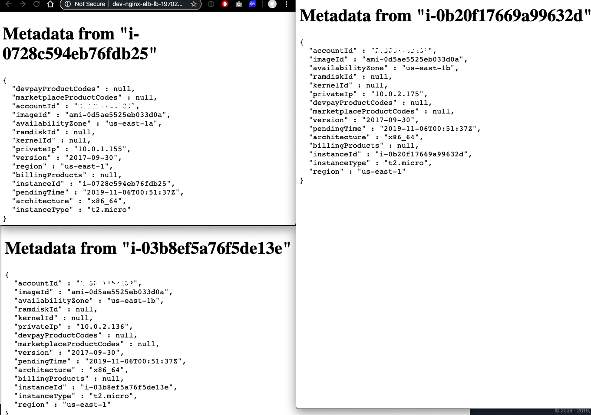

# NGINX AutoScalingGroup with ELB on Custom VPC and private subnet on RDS 


### Prerequisites

On `~/.aws/credentials` create a new profile
```
[terraform_user_profile]
aws_access_key_id=YOUR_ACCESS_KEY_ID
aws_secret_access_key=YOUR_SECRET_ACCESS_KEY
```

```
terraform@11
ssh-keygen
```

### Installing

```
brew install terraform@0.11
```

## Deployment

```sh
chmod +x deploy.sh.sh
./deploy.sh.sh
```


## How to apply changes

```sh
cd environments/dev_nginx_elb/
terraform plan
terraform apply
```

### How to SSH into instances
```sh
ssh -i "~/ssh_custom_keys/key_access_asg_nginx_example.pem" -A ec2-user@x.x.x.x
ssh ubuntu@y.y.y.y
```

### Result


### Destroy
```sh
cd environments/dev_nginx_elb/
terraform destroy
```

## Built With

* [Terraform](https://www.terraform.io/) - The web framework used
* [terraform-docs](https://github.com/segmentio/terraform-docs/) - Terraform documentation generator
* [nginx](https://www.nginx.com/) - Nginx is a web server


## Authors

* **Axel Monroy** - [Github](https://github.com/AxelMonroyX)


